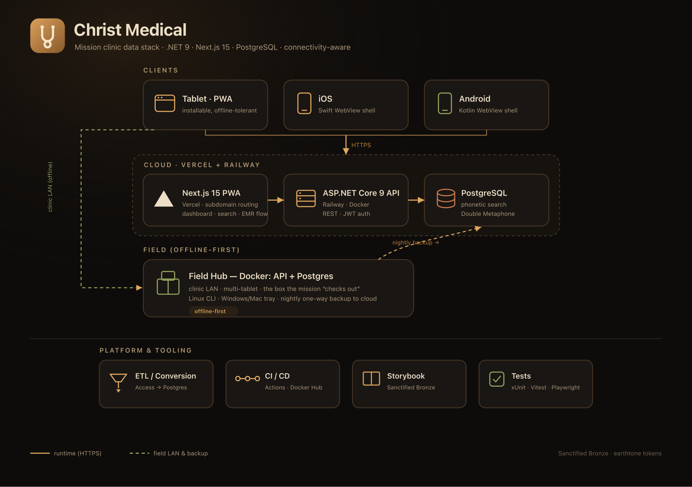

# Christ Medical

**Mission clinic data stack** — .NET API & ETL, Next.js dashboard, Postgres, and connectivity-aware UX.

<p align="center">
  <picture>
    <source media="(prefers-color-scheme: dark)" srcset="docs/assets/architecture-dark.png">
    <source media="(prefers-color-scheme: light)" srcset="docs/assets/architecture-light.png">
    
  </picture>
</p>

<p align="center">

[](https://dotnet.microsoft.com/)
[](https://nextjs.org/)
[](https://www.postgresql.org/)
[](clients/ios/)
[](clients/android/)
[](clients/desktop/)
[](LICENSE)

</p>

---

## What's in the repo

| Area | Path | Notes |
|------|------|--------|
| HTTP API | `api/` | ASP.NET Core 9, Railway-ready (`Dockerfile`) |
| ETL | `conversion/etl-tool/` | Staging → Postgres clinical migration; **`bin/` / `obj/` are gitignored** (build with `dotnet build` / `make build`) |
| UI | `frontend/` | Next.js 15 PWA on **Vercel** — sidebar **EMR workflow** (`/queue` → discharge + `/dashboard`); **Patient search** and **Patient list** under the same shell; **Storybook** (`npm run storybook`) |
| Clients | `clients/` | **iOS (Swift)** + **Android (Kotlin)** + **Desktop (Electron)** shells → `https://login.christmedical.com/`; Linux/browsers use the PWA; see [`clients/README.md`](clients/README.md) |
| Field hub | `hub/` | Docker Compose **API + Postgres** for clinic machines; Linux CLI `christmedical-hub`; see [`hub/README.md`](hub/README.md) |
| Tests | `tests/`, `frontend/**/*.test.*`, `clients/**` | .NET xUnit under `tests/` (`api.test`, `etl.test`); **Vitest** + **Testing Library** in `frontend/`; XCTest / JUnit / Node for client shells |
| Help (draft) | `docs/HELP_MANUAL.md` | Staff-facing help; keep updated as features ship |

---

## Local CI (what GitHub runs)

One command matches **lint + build + test** for .NET and the frontend:

```bash
make build
```

Or manually:

```bash
dotnet restore christmedical.com.sln
dotnet format christmedical.com.sln --verify-no-changes --no-restore
dotnet build christmedical.com.sln -c Release --no-restore
dotnet test christmedical.com.sln -c Release --no-build
cd frontend && npm ci && npm run ci
```

- **.NET**: `Directory.Build.props` turns on `EnforceCodeStyleInBuild`; `dotnet format` enforces `.editorconfig`.
- **Frontend**: `npm run ci` → ESLint, Vitest (unit tests + Storybook interaction tests via Playwright), `next build`.

When you change behavior or tooling, keep **tests** and this **README** aligned (see `.cursor/rules/tests-and-readme.mdc`).

---

## Development setup

### One-time setup (hooks + checks)

**Make (macOS / Linux):**

```bash
make setup
```

**Or the script:**

```bash
./scripts/dev-setup.sh
```

**Windows:** `scripts\dev-setup.bat`

### Handy Make targets

| Target | What it does |
|--------|----------------|
| `make help` | Lists targets |
| `make setup` | Dev environment setup |
| `make run` | **Local app**: stop processes/containers, rebuild images when needed, start db + api + web |
| `make build` | Full lint/build/test (CI parity) |
| `make schema-docs` | Regenerate `docs/schema/` from Postgres ([tbls](https://github.com/k1LoW/tbls)); needs `TBLS_DSN` or local `make db-up` |
| `make db-up` / `make db-down` | Postgres via Docker Compose |
| `make clients-test` | iOS + Android + desktop client unit tests |
| `make clients-ios-test` | iOS SwiftPM unit tests (no Simulator) |
| `make clients-android-test` | Android `./gradlew testDebugUnitTest` |
| `make clients-desktop-test` | Electron desktop config unit tests |
| `make hub-up` / `make hub-down` | Field hub compose stack (API + Postgres) |
| `make hub-status` | Hub compose status + health probes |

### Field hub (clinic server)

Docker Compose stack under `hub/` (API + Postgres). Linux operators use the CLI:

```bash
cd hub
cp .env.example .env   # edit secrets
./christmedical-hub install
./christmedical-hub start
```

Full “server person” guide: [`hub/README.md`](hub/README.md).

### Clients (native / installable shells)

iOS, Android, and Electron desktop shells live under `clients/` and load the production login portal (configurable on desktop). Linux and browsers use the PWA directly — see [`clients/README.md`](clients/README.md).

```bash
make clients-test
```

### Storybook (component library)

From `frontend/`:

```bash
npm run storybook          # dev server (port 6006)
npm run build-storybook    # static output → storybook-static/
```

**Sanctified Bronze** design tokens (`bronze-deep`, `bronze-burnished`, `bronze-glow`, `ancient-vellum`) live in `frontend/app/globals.css` under `@theme inline`, so they are available to both the Next app and Storybook.

---

## Demo (ephemeral, preloaded DB via Docker Compose)

This repo includes a demo compose override that:

- uses an **ephemeral Postgres** (tmpfs-backed) so the database is **discarded** when containers stop
- includes a **small preloaded dataset** (patients + visits) for a “works immediately” demo

Run (or use Make):

```bash
make run
# or: make demo-up   (start without stop/rebuild cycle)
```

**Publish images from your machine:** with `.env` filled in, run `make deploy` (logs in to Docker Hub when `DOCKER_USERNAME` and `DOCKER_PASSWORD` are set, otherwise reuses `~/.docker/config.json` or runs interactive `docker login`). See **`.env.example`** for the full variable list.

Then open in a browser (Compose does not open a window for you):

- **UI:** http://localhost:3000  
- **API:** http://localhost:5050/api (try http://localhost:5050/api/v1/patients?tenantId=1)

`make demo-up` prints these URLs again after `docker compose up` finishes. If the UI is blank or errors, check `docker compose -f docker-compose.demo.yaml ps` and `docker compose -f docker-compose.demo.yaml logs web` (or `api`).

Stop and discard:

```bash
make demo-down
# or: docker compose -f docker-compose.demo.yaml down
```

---

## GitHub Actions — CI and deploy

- **`ci.yml`**: On every push/PR to `main` or `develop` — restore, **verify formatting**, build all solution projects, run **xUnit** + **Vitest**, production **Next.js** build. On pushes to **`main`** only, also runs deploy jobs (below).
- **`branch-protection.yml`**: Lightweight PR reminder (no failing “gotcha” on merges).

### Deploy secrets (organization or repo)

Configure these in **GitHub → Settings → Secrets and variables → Actions**:

**Railway (API)** — job *Deploy API (Railway)*  
Link the service once locally (`railway link`) if you use a `railway.toml`, or set CLI environment equivalents in the service dashboard. CI expects the token:

| Secret | Purpose |
|--------|---------|
| `RAILWAY_TOKEN` | [Railway account token](https://docs.railway.com/guides/cli#authenticating-with-the-cli) for `railway up` |

In the Railway project, set the **root directory** to the GitHub repo root and the **Dockerfile** to `api/Dockerfile` so `COPY api/ ...` matches this repo layout. Link the service with `railway link` from the machine where you develop, or mirror those settings in the dashboard.

**Vercel (frontend)** — job *Deploy frontend (Vercel)*

| Secret | Purpose |
|--------|---------|
| `VERCEL_TOKEN` | Vercel → Settings → Tokens |
| `VERCEL_ORG_ID` | Team / user id (`vercel whoami` / project settings) |
| `VERCEL_PROJECT_ID` | Project id from Vercel |

Set the **production** build command in Vercel to match local checks, e.g. `npm run ci` (or `npm run lint && npm run test && npm run build`).

**Step-by-step production setup** (custom domain, `NEXT_PUBLIC_API_URL`, Railway Postgres, GoDaddy DNS): see **[docs/deploy-production.md](docs/deploy-production.md)**.

Quick secret upload after creating a Railway token:

```bash
# RAILWAY_TOKEN in .env or export RAILWAY_TOKEN=...
./scripts/set-railway-github-secret.sh
```

### Docker Hub (demo images)

When you push a git tag like `v0.1.0`, the workflow **Publish demo images (Docker Hub)** builds and pushes:

- `${DOCKERHUB_USERNAME}/christmedical-api:<tag>`
- `${DOCKERHUB_USERNAME}/christmedical-web:<tag>`
- `${DOCKERHUB_USERNAME}/christmedical-demo-db:<tag>`

Secrets required:

| Secret | Purpose |
|--------|---------|
| `DOCKERHUB_USERNAME` | Docker Hub username (or org) |
| `DOCKERHUB_TOKEN` | Docker Hub access token |

**Namespaces on free Docker Hub:** your **username** is one namespace; you can also create a **free organization** (separate name) and push there if your user is a member with write access. `DOCKERHUB_NAMESPACE` in `.env` should match that namespace (username or org). `DOCKER_USERNAME` / `DOCKER_PASSWORD` are the **account** you authenticate with (often your user + an access token), which may differ from the org name.

**`docker login` succeeds but `docker push` is denied** — usually one of:

1. **Read-only access token** — create a new PAT with **Read & Write** (or full) scope; read-only can still authenticate.
2. **Wrong Hub username** — use your **Docker Hub ID** from [hub.docker.com → Account settings](https://hub.docker.com/settings/general) (`-u`), not an email or display name. For a personal namespace, `DOCKER_USERNAME` and `DOCKERHUB_NAMESPACE` are normally the same string.
3. **Stale credentials** — `make deploy` now runs `docker logout docker.io` before a token login. Or sign out of **Docker Desktop** if it keeps logging you in as another user.
4. **`.env` and `$` in passwords** — GNU Make expands `$` in variables; if your token contains `$`, export the password in the shell instead of putting it in `.env`.

---

## Branching

**Current (PO/Dev):** `main` is the integration branch. Local git hooks allow direct commits and pushes to `main` (`CHRISTMEDICAL_ALLOW_MAIN=1` in `scripts/git-hooks/`). GitHub does not enforce branch protection on `main`; keep `develop` synced via merge from `main` when using both branches.

**Later (stricter):** Set `CHRISTMEDICAL_ALLOW_MAIN=0` in the hook sources, run `scripts/install-hooks.sh`, and prefer feature branches + PRs with squash merge.

If you need to undo a local commit on `main`:

```bash
git reset --soft HEAD~1   # keep changes
git checkout -b feature/my-fix
```

---

## Project layout (quick)

- `clients/` — iOS / Android / Electron shells (see [`clients/README.md`](clients/README.md))
- `hub/` — field clinic Compose stack + Linux CLI
- `scripts/` — setup and maintenance  
- `.github/workflows/` — CI/CD  
- `conversion/` — SQL, staging load, ETL, appliance images  
- `docs/` — architecture, database notes, **`docs/schema/`** (auto-generated via `make schema-docs`), **`DATABASE_MODEL.md`** (target design reference), **`HELP_MANUAL.md`** (draft user help), **`EMR_ROADMAP_CHECKLIST.md`** (EMR + spiritual roadmap)  
- **`.env.example`** — template for local Docker Hub demo/push vars (copy to **`.env`**, gitignored)

### Dashboard and search (API)

- `GET /api/v1/dashboard/summary?tenantId=` — spiritual and medical documentation aggregates.
- `GET /api/v1/patients/search?q=&spiritual=all|heard|hope|none&limit=` — name / legacy id search with **Double Metaphone** (`fuzzystrmatch`) on `first_name_phonetic` / `last_name_phonetic` (populated by ETL and backfilled on API startup).
- `GET|POST /api/v1/patients/{patientId}/visits?tenantId=` — list encounters (newest first) and create a visit with optional `vitals` payload (maps to `visits` + `vitals_core` in Postgres).

Phonetic columns are in **`conversion/etl/V6__patients_phonetic.sql`**; legacy id and phone fields for list/search are in **`V7__patients_legacy_contact.sql`** (also applied on API startup via **`EnsurePatientsLegacyAndContactColumnsAsync`** for older DB volumes).

---

## License

Christ Medical is dual-licensed:

- **Open source:** [GNU Affero General Public License v3.0](LICENSE) (AGPL-3.0).  
  SPDX: `SPDX-License-Identifier: AGPL-3.0-or-later`
- **Commercial option:** for hosting or redistribution without AGPL obligations — see [COMMERCIAL-LICENSE.md](COMMERCIAL-LICENSE.md).

Contributions require agreement to the [Contributor License Agreement](CLA.md). See [CONTRIBUTING.md](CONTRIBUTING.md).

Questions or improvements — open an issue or PR.
