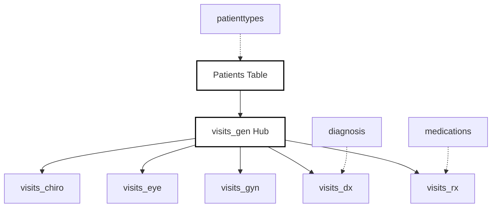

### Data Relationship Flow

### Sync & Audit Metadata Fields

| Field Name               | Data Type     | Purpose                                                               | Sync Logic                                                                                                                   |
| :----------------------- | :------------ | :-------------------------------------------------------------------- | :--------------------------------------------------------------------------------------------------------------------------- |
| **`id`**                 | `UUID`        | **Primary Key.** Global unique identifier for the record.             | Generated by the Client (C# Electron/PWA) to prevent ID collisions before the data ever reaches the cloud.                   |
| **`device_id`**          | `VARCHAR`     | Identifies the specific workstation (e.g., `WS-01`, `WS-02`).         | [cite_start]Directly supports the `Machine` component of the new Patient ID requirement. [cite: 18, 19]                      |
| **`client_updated_at`**  | `TIMESTAMPTZ` | The precise time the record was saved locally in the field.           | Used for "Last Write Wins" conflict resolution when multiple machines sync to Railway.                                       |
| **`server_restored_at`** | `TIMESTAMPTZ` | **Nullable.** When the server successfully ingested the data.         | [cite_start]If `NULL`, the Client knows the record is "dirty" and must be pushed during the "Finish Trip" phase. [cite: 101] |
| **`is_deleted`**         | `BOOLEAN`     | **Soft Delete.** Marks a record as removed without physical deletion. | Ensures a deletion on one iPad/Laptop is correctly propagated to the Cloud and other devices during sync.                    |
