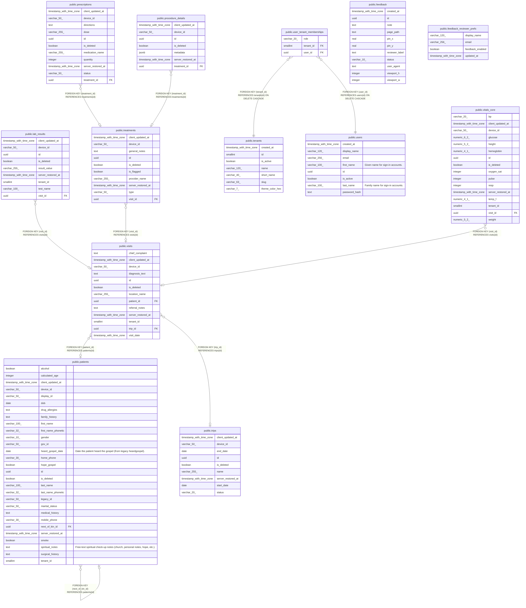

# christ_medical

## Description

Auto-generated from the live PostgreSQL `public` schema after API bootstrap migrations.  
Design reference (hand-maintained target model): docs/DATABASE_MODEL.md  

## Tables

| Name | Columns | Comment | Type | Labels |
| ---- | ------- | ------- | ---- | ------ |
| [public.feedback](public.feedback.md) | 11 | Early-reviewer UI feedback pins; standalone from clinical data. | BASE TABLE | `feedback` |
| [public.feedback_reviewer_prefs](public.feedback_reviewer_prefs.md) | 4 | Owner-controlled allowlist for who may use the in-app feedback widget. | BASE TABLE | `feedback` |
| [public.lab_results](public.lab_results.md) | 9 |  | BASE TABLE | `clinical` |
| [public.patients](public.patients.md) | 29 | Mission patient chart (tenant-scoped). | BASE TABLE | `clinical` |
| [public.prescriptions](public.prescriptions.md) | 11 |  | BASE TABLE | `clinical` |
| [public.procedure_details](public.procedure_details.md) | 7 |  | BASE TABLE | `clinical` |
| [public.tenants](public.tenants.md) | 7 | Mission/clinic registry; subdomain slug maps to tenants.slug. | BASE TABLE | `auth` |
| [public.treatments](public.treatments.md) | 10 |  | BASE TABLE | `clinical` |
| [public.trips](public.trips.md) | 9 |  | BASE TABLE | `clinical` |
| [public.user_tenant_memberships](public.user_tenant_memberships.md) | 3 | Users may belong to multiple tenants; JWT carries one active tenant per session. | BASE TABLE | `auth` |
| [public.users](public.users.md) | 8 |  | BASE TABLE | `auth` |
| [public.visits](public.visits.md) | 13 |  | BASE TABLE | `clinical` |
| [public.vitals_core](public.vitals_core.md) | 16 |  | BASE TABLE | `clinical` |

## Relations

---

> Generated by [tbls](https://github.com/k1LoW/tbls)
