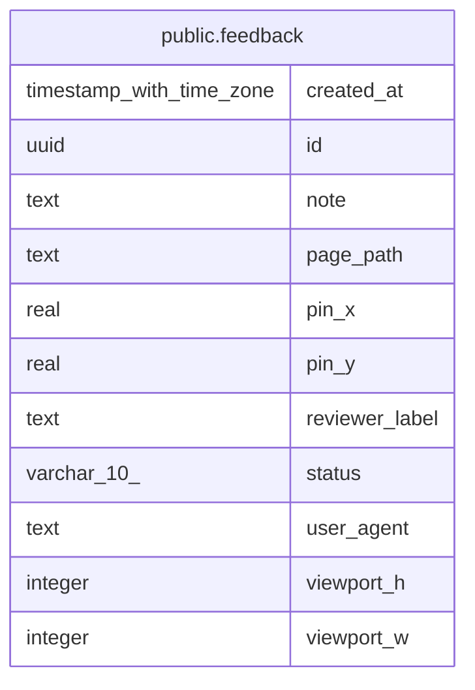

# public.feedback

## Description

Early-reviewer UI feedback pins; standalone from clinical data.

## Labels

`feedback`

## Columns

| Name | Type | Default | Nullable | Children | Parents | Comment |
| ---- | ---- | ------- | -------- | -------- | ------- | ------- |
| created_at | timestamp with time zone | CURRENT_TIMESTAMP | false |  |  |  |
| id | uuid | gen_random_uuid() | false |  |  |  |
| note | text |  | false |  |  |  |
| page_path | text |  | false |  |  |  |
| pin_x | real |  | false |  |  |  |
| pin_y | real |  | false |  |  |  |
| reviewer_label | text |  | false |  |  |  |
| status | varchar(10) | 'open'::character varying | false |  |  |  |
| user_agent | text |  | true |  |  |  |
| viewport_h | integer |  | false |  |  |  |
| viewport_w | integer |  | false |  |  |  |

## Constraints

| Name | Type | Definition |
| ---- | ---- | ---------- |
| feedback_pin_x_check | CHECK | CHECK (((pin_x >= (0)::double precision) AND (pin_x <= (1)::double precision))) |
| feedback_pin_y_check | CHECK | CHECK (((pin_y >= (0)::double precision) AND (pin_y <= (1)::double precision))) |
| feedback_pkey | PRIMARY KEY | PRIMARY KEY (id) |
| feedback_status_check | CHECK | CHECK (((status)::text = ANY ((ARRAY['open'::character varying, 'done'::character varying])::text[]))) |

## Indexes

| Name | Definition |
| ---- | ---------- |
| feedback_pkey | CREATE UNIQUE INDEX feedback_pkey ON public.feedback USING btree (id) |
| ix_feedback_created_at | CREATE INDEX ix_feedback_created_at ON public.feedback USING btree (created_at DESC) |
| ix_feedback_page_path | CREATE INDEX ix_feedback_page_path ON public.feedback USING btree (page_path) |
| ix_feedback_status | CREATE INDEX ix_feedback_status ON public.feedback USING btree (status) |

## Relations

---

> Generated by [tbls](https://github.com/k1LoW/tbls)
