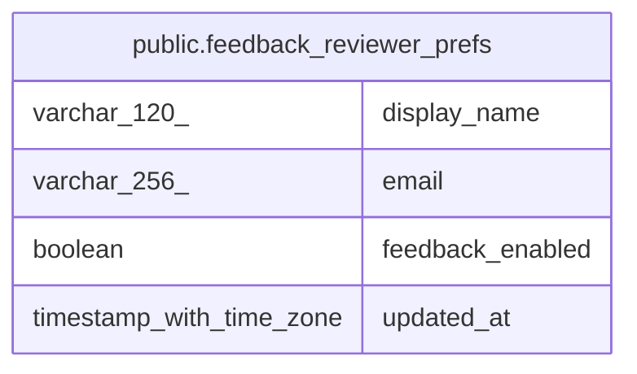

# public.feedback_reviewer_prefs

## Description

Owner-controlled allowlist for who may use the in-app feedback widget.

## Labels

`feedback`

## Columns

| Name | Type | Default | Nullable | Children | Parents | Comment |
| ---- | ---- | ------- | -------- | -------- | ------- | ------- |
| display_name | varchar(120) | ''::character varying | false |  |  |  |
| email | varchar(256) |  | false |  |  |  |
| feedback_enabled | boolean | false | false |  |  |  |
| updated_at | timestamp with time zone | CURRENT_TIMESTAMP | false |  |  |  |

## Constraints

| Name | Type | Definition |
| ---- | ---- | ---------- |
| feedback_reviewer_prefs_pkey | PRIMARY KEY | PRIMARY KEY (email) |

## Indexes

| Name | Definition |
| ---- | ---------- |
| feedback_reviewer_prefs_pkey | CREATE UNIQUE INDEX feedback_reviewer_prefs_pkey ON public.feedback_reviewer_prefs USING btree (email) |
| ux_feedback_reviewer_prefs_email | CREATE UNIQUE INDEX ux_feedback_reviewer_prefs_email ON public.feedback_reviewer_prefs USING btree (lower((email)::text)) |

## Relations

---

> Generated by [tbls](https://github.com/k1LoW/tbls)
