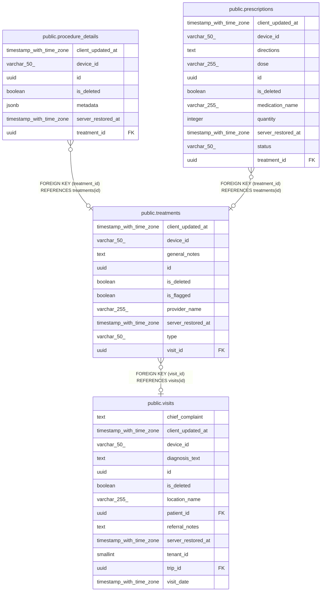

# public.procedure_details

## Labels

`clinical`

## Columns

| Name | Type | Default | Nullable | Children | Parents | Comment |
| ---- | ---- | ------- | -------- | -------- | ------- | ------- |
| client_updated_at | timestamp with time zone | CURRENT_TIMESTAMP | true |  |  |  |
| device_id | varchar(50) |  | true |  |  |  |
| id | uuid | gen_random_uuid() | false |  |  |  |
| is_deleted | boolean | false | true |  |  |  |
| metadata | jsonb |  | true |  |  |  |
| server_restored_at | timestamp with time zone |  | true |  |  |  |
| treatment_id | uuid |  | true |  | [public.treatments](public.treatments.md) |  |

## Constraints

| Name | Type | Definition |
| ---- | ---- | ---------- |
| procedure_details_pkey | PRIMARY KEY | PRIMARY KEY (id) |
| procedure_details_treatment_id_fkey | FOREIGN KEY | FOREIGN KEY (treatment_id) REFERENCES treatments(id) |

## Indexes

| Name | Definition |
| ---- | ---------- |
| procedure_details_pkey | CREATE UNIQUE INDEX procedure_details_pkey ON public.procedure_details USING btree (id) |

## Relations

---

> Generated by [tbls](https://github.com/k1LoW/tbls)
