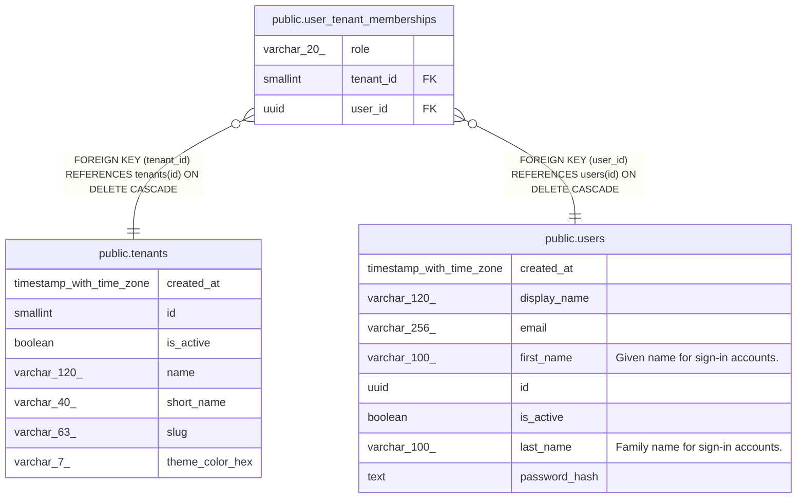

# public.tenants

## Description

Mission/clinic registry; subdomain slug maps to tenants.slug.

## Labels

`auth`

## Columns

| Name | Type | Default | Nullable | Children | Parents | Comment |
| ---- | ---- | ------- | -------- | -------- | ------- | ------- |
| created_at | timestamp with time zone | CURRENT_TIMESTAMP | false |  |  |  |
| id | smallint |  | false | [public.user_tenant_memberships](public.user_tenant_memberships.md) |  |  |
| is_active | boolean | true | false |  |  |  |
| name | varchar(120) |  | false |  |  |  |
| short_name | varchar(40) |  | false |  |  |  |
| slug | varchar(63) |  | false |  |  |  |
| theme_color_hex | varchar(7) | '#0d9488'::character varying | false |  |  |  |

## Constraints

| Name | Type | Definition |
| ---- | ---- | ---------- |
| tenants_pkey | PRIMARY KEY | PRIMARY KEY (id) |

## Indexes

| Name | Definition |
| ---- | ---------- |
| tenants_pkey | CREATE UNIQUE INDEX tenants_pkey ON public.tenants USING btree (id) |
| ux_tenants_slug | CREATE UNIQUE INDEX ux_tenants_slug ON public.tenants USING btree (lower((slug)::text)) |

## Relations

---

> Generated by [tbls](https://github.com/k1LoW/tbls)
