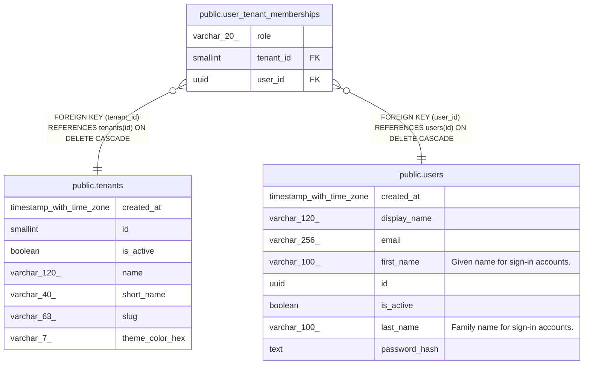

# public.user_tenant_memberships

## Description

Users may belong to multiple tenants; JWT carries one active tenant per session.

## Labels

`auth`

## Columns

| Name | Type | Default | Nullable | Children | Parents | Comment |
| ---- | ---- | ------- | -------- | -------- | ------- | ------- |
| role | varchar(20) | 'clinician'::character varying | false |  |  |  |
| tenant_id | smallint |  | false |  | [public.tenants](public.tenants.md) |  |
| user_id | uuid |  | false |  | [public.users](public.users.md) |  |

## Constraints

| Name | Type | Definition |
| ---- | ---- | ---------- |
| user_tenant_memberships_pkey | PRIMARY KEY | PRIMARY KEY (user_id, tenant_id) |
| user_tenant_memberships_role_check | CHECK | CHECK (((role)::text = ANY ((ARRAY['clinician'::character varying, 'coordinator'::character varying, 'admin'::character varying])::text[]))) |
| user_tenant_memberships_tenant_id_fkey | FOREIGN KEY | FOREIGN KEY (tenant_id) REFERENCES tenants(id) ON DELETE CASCADE |
| user_tenant_memberships_user_id_fkey | FOREIGN KEY | FOREIGN KEY (user_id) REFERENCES users(id) ON DELETE CASCADE |

## Indexes

| Name | Definition |
| ---- | ---------- |
| user_tenant_memberships_pkey | CREATE UNIQUE INDEX user_tenant_memberships_pkey ON public.user_tenant_memberships USING btree (user_id, tenant_id) |

## Relations

---

> Generated by [tbls](https://github.com/k1LoW/tbls)
