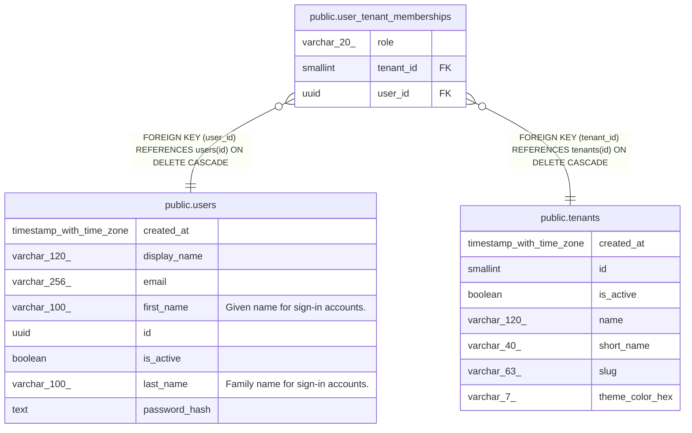

# public.users

## Labels

`auth`

## Columns

| Name | Type | Default | Nullable | Children | Parents | Comment |
| ---- | ---- | ------- | -------- | -------- | ------- | ------- |
| created_at | timestamp with time zone | CURRENT_TIMESTAMP | false |  |  |  |
| display_name | varchar(120) |  | false |  |  |  |
| email | varchar(256) |  | false |  |  |  |
| first_name | varchar(100) |  | true |  |  | Given name for sign-in accounts. |
| id | uuid | gen_random_uuid() | false | [public.user_tenant_memberships](public.user_tenant_memberships.md) |  |  |
| is_active | boolean | true | false |  |  |  |
| last_name | varchar(100) |  | true |  |  | Family name for sign-in accounts. |
| password_hash | text |  | false |  |  |  |

## Constraints

| Name | Type | Definition |
| ---- | ---- | ---------- |
| users_pkey | PRIMARY KEY | PRIMARY KEY (id) |

## Indexes

| Name | Definition |
| ---- | ---------- |
| users_pkey | CREATE UNIQUE INDEX users_pkey ON public.users USING btree (id) |
| ux_users_email | CREATE UNIQUE INDEX ux_users_email ON public.users USING btree (lower((email)::text)) |

## Relations

---

> Generated by [tbls](https://github.com/k1LoW/tbls)
