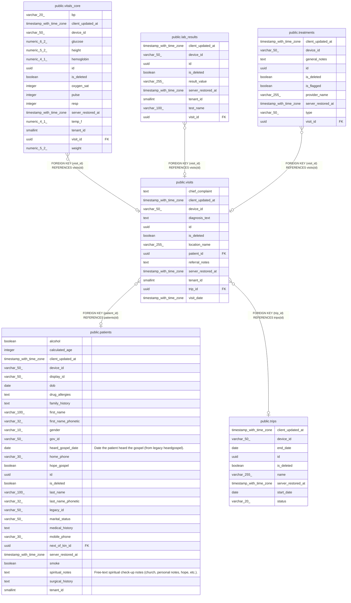

# public.vitals_core

## Labels

`clinical`

## Columns

| Name | Type | Default | Nullable | Children | Parents | Comment |
| ---- | ---- | ------- | -------- | -------- | ------- | ------- |
| bp | varchar(20) |  | true |  |  |  |
| client_updated_at | timestamp with time zone | CURRENT_TIMESTAMP | true |  |  |  |
| device_id | varchar(50) |  | true |  |  |  |
| glucose | numeric(6,2) |  | true |  |  |  |
| height | numeric(5,2) |  | true |  |  |  |
| hemoglobin | numeric(4,1) |  | true |  |  |  |
| id | uuid | gen_random_uuid() | false |  |  |  |
| is_deleted | boolean | false | true |  |  |  |
| oxygen_sat | integer |  | true |  |  |  |
| pulse | integer |  | true |  |  |  |
| resp | integer |  | true |  |  |  |
| server_restored_at | timestamp with time zone |  | true |  |  |  |
| temp_f | numeric(4,1) |  | true |  |  |  |
| tenant_id | smallint | 1 | false |  |  |  |
| visit_id | uuid |  | true |  | [public.visits](public.visits.md) |  |
| weight | numeric(5,2) |  | true |  |  |  |

## Constraints

| Name | Type | Definition |
| ---- | ---- | ---------- |
| vitals_core_pkey | PRIMARY KEY | PRIMARY KEY (id) |
| vitals_core_visit_id_fkey | FOREIGN KEY | FOREIGN KEY (visit_id) REFERENCES visits(id) |

## Indexes

| Name | Definition |
| ---- | ---------- |
| vitals_core_pkey | CREATE UNIQUE INDEX vitals_core_pkey ON public.vitals_core USING btree (id) |

## Relations

---

> Generated by [tbls](https://github.com/k1LoW/tbls)
